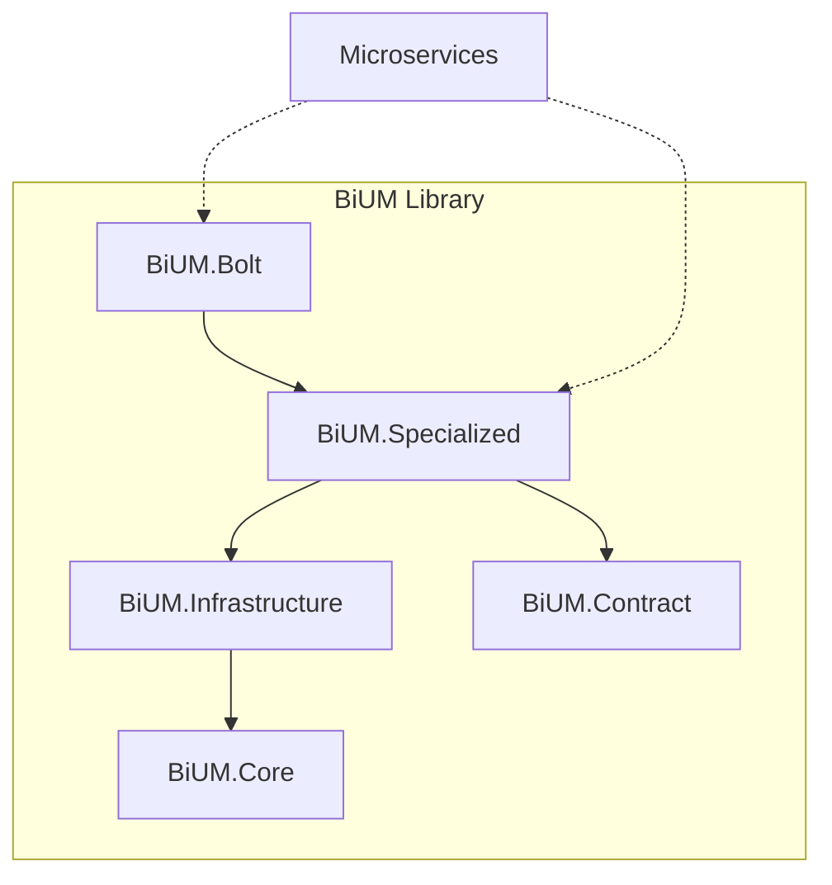

# AGENTS.md - BiUM (BiApp Universal Modules)

## 1. Project Overview

**BiUM** is the foundational shared library for the **FunctiOnAir (FOA)** microservices ecosystem. It defines the standard for logging, data access, messaging, and error handling across all business applications.

### Architecture

The library is organized hierarchically. **BiUM.Bolt** is the most specialized consumer, while **BiUM.Core** provides the base abstractions.

## 2. Technology Stack

- **Framework**: .NET 10
- **ORM**: Entity Framework Core 8 (SQL Server, PostgreSQL, InMemory)
- **Messaging**: RabbitMQ (via MassTransit/Raw Client)
- **Logging**: OpenTelemetry (Protocol & Console Exporters)
- **gRPC**: Grpc.AspNetCore
- **Validation**: FluentValidation
- **Mapping**: AutoMapper

## 3. Codebase Structure

### `src/` Modules

- **`BiUM.Core`**: Base abstractions and interfaces.
    - `Common/`: Utilities, Config Options (`BoltOptions`, `RabbitMQOptions`).
    - `Database/`: `IRepository`, `IUnitOfWork`.
    - `MessageBroker/`: `IEventBus`.
    - `Logging/`: Logging interfaces.

- **`BiUM.Infrastructure`**: Concrete implementations of Core.
    - `Persistence/`: EF Core base implementations.
    - `Services/`: FileService (`SimpleHtmlToPdf`), Redis, RabbitMQ implementations.

- **`BiUM.Contract`**: Shared resources.
    - `common.proto`: Standard gRPC message definitions.

- **`BiUM.Specialized`**: High-level integration and features.
    - `Interceptors/`: EF Core/gRPC interceptors.
    - `Services/`: Domain-agnostic services (`ICrudService`).
    - `Extensions/`: `AddSpecializedServices` configuration.

- **`BiUM.Bolt`**: Specialized Data Access.
    - Builds on top of `Specialized` to provide specific database initialization and configuration patterns (PostgreSQL focused).

## 4. AI Agent Guidelines

> [!IMPORTANT]
> **Documentation Sync**: Any changes to the code must be immediately reflected in this `AGENTS.md` or the respective module's `README.md`.

### Critical Rules
1. **Dependency Direction**: Respect the hierarchy. `Core` should never depend on `Infrastructure`.
2. **Configuration**: Use `Options` pattern for all new configurations (defined in `Core.Common.Configs`).
3. **Logging**: All services must utilize the configured OpenTelemetry patterns.

## 5. Related Agents/Services

**BiUM** is a dependency for **ALL** FOA services.

- [BiApp.Gateway](../BiApp.Gateway/AGENTS.md)
- [BiApp.Accounting](../BiApp.Accounting/AGENTS.md)
- [BiApp.Accounts](../BiApp.Accounts/AGENTS.md)
- [BiApp.AiAssistant](../BiApp.AiAssistant/AGENTS.md)
- [BiApp.Authentication](../BiApp.Authentication/AGENTS.md)
- [BiApp.Audit](../BiApp.Audit/AGENTS.md)
- [BiApp.Bpmn](../BiApp.Bpmn/AGENTS.md)
- [BiApp.Collections](../BiApp.Collections/AGENTS.md)
- [BiApp.Configuration](../BiApp.Configuration/AGENTS.md)
- [BiApp.Customers](../BiApp.Customers/AGENTS.md)
- [BiApp.Dms](../BiApp.Dms/AGENTS.md)
- [BiApp.EnergyTracking](../BiApp.EnergyTracking/AGENTS.md)
- [BiApp.Expenses](../BiApp.Expenses/AGENTS.md)
- [BiApp.Information](../BiApp.Information/AGENTS.md)
- [BiApp.Messaging](../BiApp.Messaging/AGENTS.md)
- [BiApp.Observability](../BiApp.Observability/AGENTS.md)
- [BiApp.Parameters](../BiApp.Parameters/AGENTS.md)
- [BiApp.PortalConfiguration](../BiApp.PortalConfiguration/AGENTS.md)
- [BiApp.Products](../BiApp.Products/AGENTS.md)
- [BiApp.Purchases](../BiApp.Purchases/AGENTS.md)
- [BiApp.Sales](../BiApp.Sales/AGENTS.md)
- [BiApp.Scheduler](../BiApp.Scheduler/AGENTS.md)
- [BiApp.Stocks](../BiApp.Stocks/AGENTS.md)
- [BiApp.Treasury](../BiApp.Treasury/AGENTS.md)
