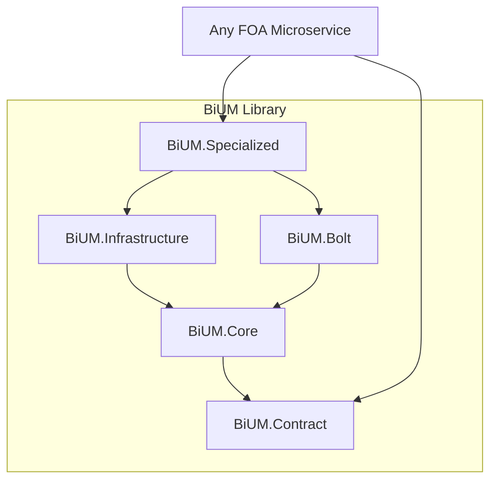

# AGENTS.md - BiUM (Core Library)

## 1. Project Overview

**BiUM** is the foundational shared library for the FunctionOnAir (FOA) microservices ecosystem. It provides the core building blocks, abstractions, and infrastructure implementations used across all business applications and the API Gateway. It ensures consistency in logging, data access, messaging, and error handling.

### Architecture

BiUM is designed as a modular library set.



## 2. Technology Stack

- **Framework**: .NET 8
- **ORM**: Entity Framework Core (implied by Database modules)
- **Messaging**: MassTransit (implied by MessageBroker abstractions)
- **Logging**: Serilog
- **Mapping**: AutoMapper (implied by Mapping module in Specialized)
- **Package Management**: NuGet (GitHub Packages)

## 3. Codebase Structure

### `src/` Modules

- **`BiUM.Core`**: The heart of the library. Contains interfaces, base classes, and core utilities.
    - `Caching/`: Caching abstractions.
    - `Database/`: Repository interfaces and unit of work patterns.
    - `MessageBroker/`: Event bus interfaces.
    - `Logging/`: Logging abstractions.
    - `HttpClients/`: Base HTTP client wrappers.

- **`BiUM.Infrastructure`**: Concrete implementations of Core abstractions.
    - `Persistence/`: EF Core implementations.
    - `Services/`: Infrastructure services (e.g., FileSystem, Email).

- **`BiUM.Bolt`**: A specialized, lightweight data access module (likely for local or high-performance scenarios).
    - `Database/`: Bolt-specific database logic.

- **`BiUM.Specialized`**: Advanced components and domain-agnostic business logic helpers.
    - `Interceptors/`: EF Core or gRPC interceptors.
    - `Mapping/`: AutoMapper profiles and helpers.
    - `Services/`: Specialized domain services.

- **`BiUM.Contract`**: Shared Data Transfer Objects (DTOs) and API contracts used for inter-service communication.

## 4. Key Components & Features

### Standardized Configuration
BiUM provides `ConfigureServices` and `ConfigureApp` extension methods to standardize startup logic across all microservices.

### Data Access (Bolt & EF Core)
Provides a unified repository pattern and Unit of Work implementation, allowing services to interact with databases consistently. `BiUM.Bolt` offers a lightweight alternative or supplement to standard EF Core.

### Messaging
Abstracts the underlying message broker (likely RabbitMQ via MassTransit), allowing services to publish and subscribe to events without coupling to specific broker implementations.

### Cross-Cutting Concerns
- **Logging**: Standardized Serilog configuration.
- **Caching**: Distributed and in-memory caching wrappers.
- **Validation**: Request validation pipelines.

## 5. Development Workflow

### Installation
BiUM is distributed as a set of NuGet packages via GitHub Packages.

```bash
dotnet add package BiUM.Specialized --source "https://nuget.pkg.github.com/FOA-FunctiOnAir/index.json"
```

### Building Locally
```bash
dotnet restore
dotnet build
```

### Publishing
Packages are typically packed and pushed to the private GitHub NuGet feed via CI/CD pipelines.

## 6. Configuration Guide

Services consuming BiUM typically configure it in `Program.cs`:

```csharp
// Example usage in a microservice
builder.Services.AddBiUMSpecialized(builder.Configuration);
```

Key settings in `appsettings.json` often include:
- `ConnectionStrings`: Database connections.
- `RabbitMQ`: Message broker settings.
- `Redis`: Caching settings.

## 7. Related Agents/Services

As the core library, **BiUM** is a dependency for **ALL** other agents and services in the ecosystem.

- [BiApp.Gateway](../BiApp.Gateway/AGENTS.md)
- [BiApp.Authentication](../BiApp.Authentication/AGENTS.md)
- [BiApp.Accounting](../BiApp.Accounting/AGENTS.md)
- [BiApp.Accounts](../BiApp.Accounts/AGENTS.md)
- [BiApp.Bpmn](../BiApp.Bpmn/AGENTS.md)
- [BiApp.Collections](../BiApp.Collections/AGENTS.md)
- [BiApp.Configuration](../BiApp.Configuration/AGENTS.md)
- [BiApp.Customers](../BiApp.Customers/AGENTS.md)
- [BiApp.Diagram](../BiApp.Diagram/AGENTS.md)
- [BiApp.Dms](../BiApp.Dms/AGENTS.md)
- [BiApp.EnergyTracking](../BiApp.EnergyTracking/AGENTS.md)
- [BiApp.Expenses](../BiApp.Expenses/AGENTS.md)
- [BiApp.Parameters](../BiApp.Parameters/AGENTS.md)
- [BiApp.PortalConfiguration](../BiApp.PortalConfiguration/AGENTS.md)
- [BiApp.Products](../BiApp.Products/AGENTS.md)
- [BiApp.Purchases](../BiApp.Purchases/AGENTS.md)
- [BiApp.Sales](../BiApp.Sales/AGENTS.md)
- [BiApp.Stocks](../BiApp.Stocks/AGENTS.md)
- [BiApp.Treasury](../BiApp.Treasury/AGENTS.md)
