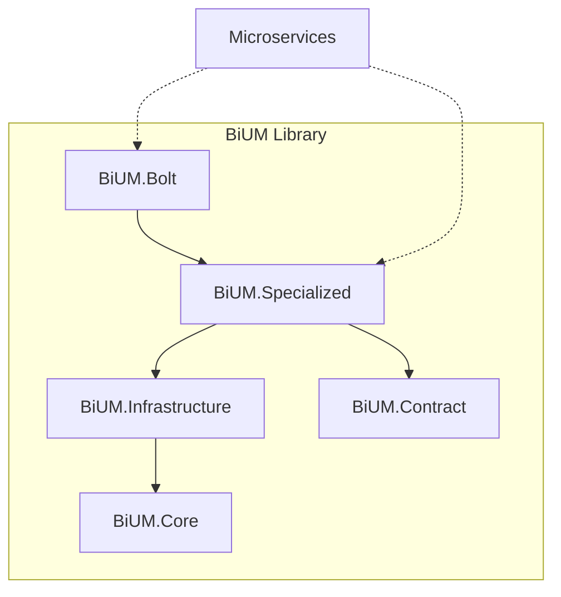

# AGENTS.md - BiUM (BiApp Universal Modules)

## 1. Project Overview

**BiUM** is the foundational shared library for the **FunctiOnAir (FOA)** microservices ecosystem. It defines the standard for logging, data access, messaging, and error handling across all business applications.

### Architecture

The library is organized hierarchically. **BiUM.Bolt** is the most specialized consumer, while **BiUM.Core** provides the base abstractions.

```mermaid
graph TD
    subgraph BiUM Library
        Core[BiUM.Core]
        Infra[BiUM.Infrastructure]
        Spec[BiUM.Specialized]
        Contract[BiUM.Contract]
        Bolt[BiUM.Bolt]
    end

    Infra --> Core
    Spec --> Infra
    Spec --> Contract
    Bolt --> Spec

    Microservice[Microservices] -.-> Spec
    Microservice -.-> Bolt
```

## 2. Technology Stack

- **Framework**: .NET 10
- **ORM**: Entity Framework Core 8 (SQL Server, PostgreSQL, InMemory)
- **Messaging**: RabbitMQ (via MassTransit/Raw Client)
- **Logging**: OpenTelemetry (Protocol & Console Exporters)
- **gRPC**: Grpc.AspNetCore
- **Validation**: FluentValidation
- **Mapping**: AutoMapper

## 3. Codebase Structure

### Deep-dive agent docs

- [Agents.MsStructure.md](Agents.MsStructure.md) — **Shared FOA microservice technical layout** (layers, `Program.cs`, BiUM pipeline, persistence/messaging patterns). Business domain per service stays in that service’s `AGENTS.md`.
- [Agents.Crud.md](Agents.Crud.md) — `DomainCrud` metadata vs runtime CRUD, tenant rules, `CrudController`.
- [Agents.HttpClientService.md](Agents.HttpClientService.md) — `IHttpClientsService` / `HttpClientService`, URL resolution, correlation header.
- [Agents.Compensation.md](Agents.Compensation.md) — compensation session, snapshots, `CompensatableApi` / `CompensatableApiActionFilter`, `CompensationSessionFinalized` event.
- [Agents.CorrelationContext.md](Agents.CorrelationContext.md) — `CorrelationContext` model, `x-correlation-context`, serializer, accessor.
- [Agents.EncryptedData.md](Agents.EncryptedData.md) — `[EncryptedData]`, EF value converter, `BaseDbContext` + `BiAppOptions.EncryptionKey`.
- [Agents.Database.md](Agents.Database.md) — `AddDatabase`, providers, retry, health checks, `IDbContext` registration.
- [Agents.RequestPipeline.md](Agents.RequestPipeline.md) — `UseInfrastructure`, `UseSpecialized`, request transaction, exception and rollback behavior.
- [Agents.MessageBroker.md](Agents.MessageBroker.md) — `RabbitMQClient` publish path, headers, correlation on messages.

### `src/` Modules

- **`BiUM.Core`**: Base abstractions and interfaces.
    - `Common/`: Utilities, Config Options (`BoltOptions`, `RabbitMQOptions`); `BiAppOptions` includes `EncryptionKey` for `[EncryptedData]` conversion.
    - `Common/Attributes/`: `EncryptedDataAttribute` for marking properties as encrypted/hashed at persistence (with `Reversible` flag).
    - `Common/Utils/`: `EncryptionHelper` for Encrypt/Decrypt (byte[] or string), Hash/Verify (non-reversible), Protect/Unprotect (reversible flag); used by the value converter and by application code (e.g. login, export).
    - `Database/`: `IRepository`, `IUnitOfWork`.
    - `MessageBroker/`: `IEventBus`.
    - `Logging/`: Logging interfaces.

- **`BiUM.Infrastructure`**: Concrete implementations of Core.
    - `Persistence/`: EF Core base implementations, `ValueConverters/EncryptedDataValueConverter`, `Extensions/ModelBuilderEncryptedDataExtensions` (apply `[EncryptedData]` conversion from model with encryption key).
    - `Services/`: FileService (`SimpleHtmlToPdf`), Redis, RabbitMQ. Inter-service HTTP client: see [Agents.HttpClientService.md](Agents.HttpClientService.md). `Services/Compensation/`: `CompensationSessionFinalizedPublisher`.

- **`BiUM.Contract`**: Shared resources.
    - `Models/Api/`: `ApiResponse`, `ApiResponseRollbackException` (internal rollback signal for failed `ApiResponse` in request transactions), `ApiResponseLogSummary` (log metni için mesaj özeti).
    - `common.proto`: Standard gRPC message definitions.

- **`BiUM.Specialized`**: High-level integration and features.
    - `Middlewares/`: `RequestTransactionMiddleware` wraps mutating HTTP requests (POST/PUT/PATCH/DELETE) for the scoped main `IDbContext` in `IExecutionStrategy.ExecuteAsync` with `BeginTransactionAsync` / commit or rollback so EF retry policies remain valid. Skips GET/HEAD/OPTIONS, gRPC, InMemory provider, `/health*`, `/swagger*`, `/version`. Registered in `UseSpecialized` (after `UseRouting` from `UseInfrastructure`).
    - `Common/API/`: `ApiResponseTransactionRollbackFilter` throws `ApiResponseRollbackException` when `ApiResponse.Success` is false so the request transaction rolls back; `UseInfrastructure` exception handler writes the carried `ApiResponse` JSON and logs rollback details at **Error**. `ApiResponseLoggingFilter` logs each outbound `ApiResponse` / `ApiResponse<T>` message by severity (Error → `LogError`) with request path. `[CompensatableApi]` on a controller or action marks the **main** compensatable endpoint (`CompensatableApiActionFilter`: session + local commit/rollback + `CompensationSessionFinalized` publish). Dynamic CRUD HTTP surface: [Agents.Crud.md](Agents.Crud.md) — `CrudController` exposes `Save`, `SavePartial`, `Delete`, `Get` (list and by id via query); publishing a Domain CRUD triggers BiApp.Configuration to register matching **service catalog** entries plus one **SavePartial** service per partial code.
    - `Interceptors/`: `EntitySaveChangesInterceptor` (rejects `SaveChanges` during HTTP GET when `IHttpContextAccessor` is present and there are tracked changes), gRPC interceptors.
    - `Database/`: `BaseDbContext` / `IDbContext` — `DomainDynamicApi*` EF modeli kapalı (DbSet + arayüz üyeleri yorumda, `Ignore`); varlık sınıfları Infrastructure’da duruyor. [Agents.Crud.md](Agents.Crud.md).
    - `Database/Extensions.cs` (`AddDatabase`): PostgreSQL and MSSQL register `EnableRetryOnFailure` so execution strategy and request transactions align.
    - `Services/`: `ICrudService`, `ICompensationService`, and related behavior: [Agents.Crud.md](Agents.Crud.md). Uses `IHttpClientsService` for outbound calls where documented in [Agents.HttpClientService.md](Agents.HttpClientService.md).
    - `Extensions/`: `AddSpecializedServices` configuration.

- **`BiUM.Bolt`**: Specialized Data Access.
    - Builds on top of `Specialized` to provide specific database initialization and configuration patterns (PostgreSQL focused).

## 4. AI Agent Guidelines

> [!IMPORTANT]
> **Documentation Sync**: Any changes to the code must be immediately reflected in this `AGENTS.md`, the relevant `Agents.*.md` deep-dive (e.g. [Agents.MsStructure.md](Agents.MsStructure.md), [Agents.Crud.md](Agents.Crud.md), [Agents.HttpClientService.md](Agents.HttpClientService.md), [Agents.Compensation.md](Agents.Compensation.md), [Agents.CorrelationContext.md](Agents.CorrelationContext.md), [Agents.EncryptedData.md](Agents.EncryptedData.md), [Agents.Database.md](Agents.Database.md), [Agents.RequestPipeline.md](Agents.RequestPipeline.md), [Agents.MessageBroker.md](Agents.MessageBroker.md)), or the respective module's `README.md`.

### Critical Rules
1. **Dependency Direction**: Respect the hierarchy. `Core` should never depend on `Infrastructure`.
2. **Configuration**: Use `Options` pattern for all new configurations (defined in `Core.Common.Configs`).
3. **Logging**: All services must utilize the configured OpenTelemetry patterns.

## 5. Related Agents/Services

**BiUM** is a dependency for **ALL** FOA services.

- [BiApp.Gateway](../BiApp.Gateway/AGENTS.md)
- [BiApp.Accounting](../BiApp.Accounting/AGENTS.md)
- [BiApp.Accounts](../BiApp.Accounts/AGENTS.md)
- [BiApp.AiAssistant](../BiApp.AiAssistant/AGENTS.md)
- [BiApp.Authentication](../BiApp.Authentication/AGENTS.md)
- [BiApp.Audit](../BiApp.Audit/AGENTS.md)
- [BiApp.Board](../BiApp.Board/AGENTS.md)
- [BiApp.Bpmn](../BiApp.Bpmn/AGENTS.md)
- [BiApp.Collections](../BiApp.Collections/AGENTS.md)
- [BiApp.Configuration](../BiApp.Configuration/AGENTS.md) (see also business deep-dives in that repo)
- [BiApp.Customers](../BiApp.Customers/AGENTS.md)
- [BiApp.Diagram](../BiApp.Diagram/AGENTS.md)
- [BiApp.Dms](../BiApp.Dms/AGENTS.md)
- [BiApp.EnergyTracking](../BiApp.EnergyTracking/AGENTS.md)
- [BiApp.Expenses](../BiApp.Expenses/AGENTS.md)
- [BiApp.Foactor](../BiApp.Foactor/AGENTS.md)
- [BiApp.HumanResources.Absence](../BiApp.HumanResources.Absence/AGENTS.md)
- [BiApp.Information](../BiApp.Information/AGENTS.md)
- [BiApp.Messaging](../BiApp.Messaging/AGENTS.md)
- [BiApp.Observability](../BiApp.Observability/AGENTS.md)
- [BiApp.Offers](../BiApp.Offers/AGENTS.md)
- [BiApp.Parameters](../BiApp.Parameters/AGENTS.md)
- [BiApp.PortalConfiguration](../BiApp.PortalConfiguration/AGENTS.md)
- [BiApp.Products](../BiApp.Products/AGENTS.md)
- [BiApp.Purchases](../BiApp.Purchases/AGENTS.md)
- [BiApp.Sales](../BiApp.Sales/AGENTS.md)
- [BiApp.Scheduler](../BiApp.Scheduler/AGENTS.md)
- [BiApp.Stocks](../BiApp.Stocks/AGENTS.md)
- [BiApp.Treasury](../BiApp.Treasury/AGENTS.md)
