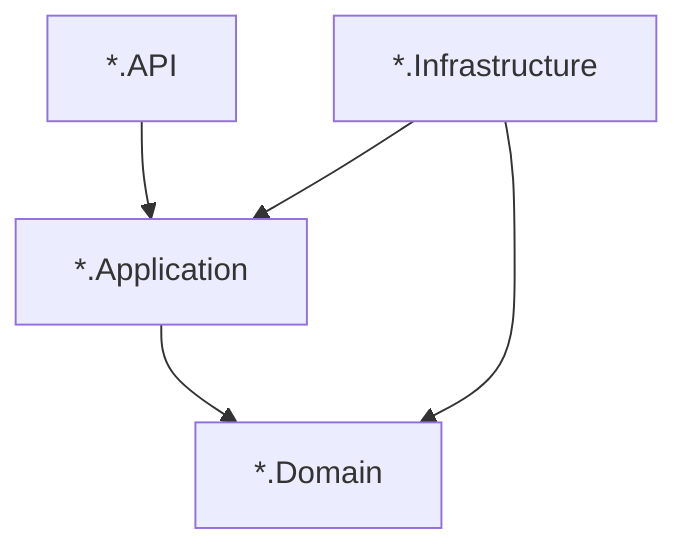

# Agents.MsStructure.md — FOA microservice technical structure

This document describes the **shared technical shape** of FOA microservices built on **BiUM**. It is the single place for layer names, startup patterns, and cross-cutting integration points. **Business domain** for a specific service belongs in that service’s `AGENTS.md` and any `Agents.*.md` files there.

BiUM behavior (CRUD, HTTP clients, correlation, messaging, compensation, etc.) is detailed in the other `Agents.*.md` files in this repository.

## 1. Typical solution layout (Clean Architecture)

Most `BiApp.*` services use four main projects:

| Project | Role |
|--------|------|
| `{Service}.API` | ASP.NET Core host, controllers, `Program.cs`, static files if any |
| `{Service}.Application` | Use cases, MediatR handlers, DTOs, validators, repository **interfaces**, `ConfigureServices` entry for application DI |
| `{Service}.Domain` | Entities, domain markers, minimal logic |
| `{Service}.Infrastructure` | EF Core `DbContext`, repository implementations, `ConfigureServices` / `ConfigureApps`, migrations |

Optional: `{Service}.Contract` for gRPC or shared DTOs consumed by other apps.

Dependency rule: **Domain** has no reference to Application or Infrastructure. **Application** references Domain only. **Infrastructure** references Application and Domain to implement interfaces.

## 2. `Program.cs` and BiUM host wiring

A typical `Program.cs`:

1. Builds the web application and configuration (optional: `OverrideAppLocalServices()` in DEBUG).
2. Calls **`ConfigureCoreServices()`**, **`ConfigureInfrastructureServices()`**, **`ConfigureSpecializedServices()`** on the builder (BiUM extension pattern).
3. Registers domain-specific services, commonly:
   - `AddDomainApplicationServices(configuration)` — MediatR, application marker, AutoMapper profile, etc.
   - `AddDomainInfrastructureServices(configuration)` — database, repositories, Bolt if used.
4. Calls **`ConfigureSpecializedHost()`** when required by the template.
5. After `Build()`:
   - Optional: `UseMigrationsEndPoint()` in Development.
   - **`await app.Services.SyncAll()`** or similar when the solution defines startup sync (database initialiser, Bolt sync).
6. Pipeline: **`UseCore()`** → **`UseInfrastructure()`** → **`UseSpecialized()`**.
7. Domain pipeline hooks: e.g. `AddDomainInfrastructureApps()`.
8. Maps controllers / Razor / gRPC / health as needed.

Exact names may vary (`AddDomain*` vs `Add*ApplicationServices`); the **idea** is: BiUM first, then domain DI, then BiUM middleware order.

## 3. API surface

- Controllers often inherit **`ApiControllerBase`** (BiUM.Specialized) and use **`IMediator`** for CQRS.
- Route prefix may be set with **`[BiUMRoute("...")]`** so the service is grouped under a stable API segment (e.g. gateway routing).
- Responses commonly use **`ApiResponse<T>`** / **`ApiResponse`** from BiUM.Contract.

See [Agents.RequestPipeline.md](Agents.RequestPipeline.md) for request transactions, rollback on failed `ApiResponse`, and exception handling.

## 4. Application layer (CQRS)

- Handlers live under **`Features/{Area}/Commands/...`** and **`Features/{Area}/Queries/...`** (or equivalent folder names).
- **MediatR** dispatches commands and queries from controllers.
- **AutoMapper** profiles often inherit BiUM’s **`MappingProfile<TApplicationMarker, TDomainMarker>`** pattern.
- **FluentValidation** may validate commands/queries where configured.

## 5. Persistence- **`AddDatabase<TDbContext, TInitialiser>(configuration)`** registers the main EF Core context (see [Agents.Database.md](Agents.Database.md)).
- The context usually inherits **`BaseDbContext`** (encryption, interceptors, tenant/correlation awareness as configured).
- Repositories are **`Scoped`**, depend on **`IDbContext`** / a typed context interface, and implement interfaces declared in Application.

## 6. Optional: Bolt

Services that sync metadata or use Bolt registers a second context via **`AddBolt<TBoltContext, TInitialiser>`** and expose **`IBoltDbContext`**. Startup may call **`SyncBolt()`** alongside database initialisation.

## 7. Optional: messaging and HTTP

- **RabbitMQ**: `RabbitMQOptions` and **`IRabbitMQClient`** for publishing events (see [Agents.MessageBroker.md](Agents.MessageBroker.md)). Not every service publishes; some only consume or use neither.
- **Inter-service HTTP**: `HttpClientsOptions` / **`IHttpClientsService`** (see [Agents.HttpClientService.md](Agents.HttpClientService.md)).
- **gRPC**: `BiGrpcOptions` where the service calls other domains via gRPC.

## 8. Configuration (`appsettings`)

Common sections (presence depends on service):

- **`BiAppOptions`** — domain name, port, environment flags.
- **`ConnectionStrings`** — main database (PostgreSQL and/or MSSQL per deployment).
- **`DatabaseType`** — provider selection where used.
- **`BoltOptions`** — when Bolt is enabled.
- **`RabbitMQOptions`**, **`RedisClientOptions`**, **`HttpClientsOptions`**, **`BiGrpcOptions`**.

Secrets must not be committed; local overrides use `appsettings.Local.json` or environment variables per team practice.

## 9. Exceptions and special hosts

- **BiApp.Gateway** is an API gateway (e.g. Ocelot): same .NET/BiUM logging and hosting patterns may apply, but **layering is not the four-project Clean Architecture** described above. See that repo’s `AGENTS.md`.
- **BiApp.Net.Root** is not a runnable microservice; it holds solution-level tooling.

## 10. Agent workflow

1. Read **this file** for **where code belongs** and **how the host is wired**.
2. Read **BiUM** `AGENTS.md` and the relevant **`Agents.*.md`** deep dives for the feature you touch.
3. Read the **target service’s** `AGENTS.md` for **business context** and domain vocabulary.

**Stable URLs (clone layout–agnostic):** [Agents.MsStructure.md](https://github.com/FOA-FunctiOnAir/BiUM/blob/master/Agents.MsStructure.md), [AGENTS.md](https://github.com/FOA-FunctiOnAir/BiUM/blob/master/AGENTS.md). Microservice repos should link here with these GitHub paths, not `../BiUM/...`, so links work for every developer machine.

When you change cross-cutting startup or persistence behavior in BiUM, update this file if the **documented contract** for microservices changes.
