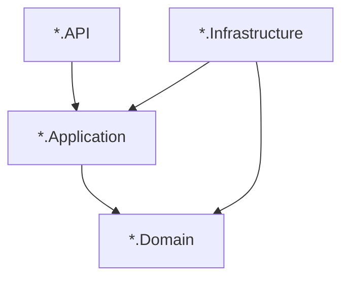

# Agents.MsStructure.md — FOA microservice technical structure

This document describes the **shared technical shape** of FOA microservices built on **BiUM**. It is the single place for layer names, startup patterns, and cross-cutting integration points. **Business domain** for a specific service belongs in that service’s `AGENTS.md` and any `Agents.*.md` files there.

BiUM behavior (CRUD, HTTP clients, correlation, messaging, compensation, etc.) is detailed in the other `Agents.*.md` files in this repository.

## 1. Typical solution layout (Clean Architecture)

Most `BiApp.*` services use four main projects:

| Project | Role |
|--------|------|
| `{Service}.API` | ASP.NET Core host, controllers, `Program.cs`, static files if any |
| `{Service}.Application` | Use cases, MediatR handlers, DTOs, validators, repository **interfaces**, `ConfigureServices` entry for application DI |
| `{Service}.Domain` | Entities, domain markers, minimal logic |
| `{Service}.Infrastructure` | EF Core `DbContext`, repository implementations, `ConfigureServices` / `ConfigureApps`, migrations |

Optional: `{Service}.Contract` for gRPC or shared DTOs consumed by other apps.

Dependency rule: **Domain** has no reference to Application or Infrastructure. **Application** references Domain only. **Infrastructure** references Application and Domain to implement interfaces.

## 2. `Program.cs` and BiUM host wiring

A typical `Program.cs`:

1. Builds the web application and configuration (optional: `OverrideAppLocalServices()` in DEBUG).
2. Calls **`ConfigureCoreServices()`**, **`ConfigureInfrastructureServices()`**, **`ConfigureSpecializedServices()`** on the builder (BiUM extension pattern).
3. Registers domain-specific services, commonly:
   - `AddDomainApplicationServices(configuration)` — MediatR, application marker, AutoMapper profile, etc.
   - `AddDomainInfrastructureServices(configuration)` — database, repositories, Bolt if used.
4. Calls **`ConfigureSpecializedHost()`** when required by the template.
5. After `Build()`:
   - Optional: `UseMigrationsEndPoint()` in Development.
   - **`await app.Services.SyncAll()`** or similar when the solution defines startup sync (database initialiser, Bolt sync).
6. Pipeline: **`UseCore()`** → **`UseInfrastructure()`** → **`UseSpecialized()`**.
7. Domain pipeline hooks: e.g. `AddDomainInfrastructureApps()`.
8. Maps controllers / Razor / gRPC / health as needed.

Exact names may vary (`AddDomain*` vs `Add*ApplicationServices`); the **idea** is: BiUM first, then domain DI, then BiUM middleware order.

## 3. API surface

### 3.1 Service identity (compound / multi-segment names)

When a microservice name has **more than one logical segment** (e.g. bounded context + feature, as in `Education.Coach` or `HumanResources.Absence`), align these consistently:

| Artifact | Convention | Example (`Education.Coach`) |
|----------|------------|-------------------------------|
| **`BiAppOptions.Domain`** | PascalCase segments separated by **`.`** | `Education.Coach` |
| **`HttpClientsOptions.Domains` / `BiGrpcOptions.Domains` keys** | Same spelling as domain, **`ToLowerInvariant()`** for lookup (dots preserved; see `HttpClientService`) | `education.coach` |
| **`[BiUMRoute("...")]`** (`BiUM.Specialized`) | Lowercase segments separated by **`/`** (URL segment under `/api/`). Resolves to `/api/{segments}/[controller]/[action]`. | `[BiUMRoute("education/coach")]` |
| **PostgreSQL database name** (and similar identifiers) | Segments joined with **underscore `_`**, lowercase | `education_coach` |

Single-segment services keep the same rules without dots (e.g. `BiAppOptions.Domain`: `Accounts`, route: `[BiUMRoute("accounts")]`, domain map key: `accounts`).

In **`appsettings.Local.json`**, list entries under `BiGrpcOptions.Domains` and `HttpClientsOptions.Domains` **in alphabetical order by key** so diffs stay predictable.

### 3.2 Controllers and responses

- Controllers often inherit **`ApiControllerBase`** (BiUM.Specialized) and use **`IMediator`** for CQRS.
- Route prefix may be set with **`[BiUMRoute("...")]`** so the service is grouped under a stable API segment (e.g. gateway routing).
- Responses commonly use **`ApiResponse<T>`** / **`ApiResponse`** from BiUM.Contract.

See [Agents.RequestPipeline.md](Agents.RequestPipeline.md) for request transactions, rollback on failed `ApiResponse`, and exception handling.

## 4. Application layer (CQRS)

- Handlers live under **`Features/{Area}/Commands/...`** and **`Features/{Area}/Queries/...`** (or equivalent folder names).
- **MediatR** dispatches commands and queries from controllers.
- **AutoMapper** profiles often inherit BiUM’s **`MappingProfile<TApplicationMarker, TDomainMarker>`** pattern.
- **FluentValidation** may validate commands/queries where configured.

### GetFw*ForParameter (parameter select)

Endpoint-backed parameters (`BiParameterSelect` / `GetFwParameterValues`) call **`GetFw{Entity}ForParameter`** on the owning microservice. All such endpoints share one CQRS shape:

| Layer | Standard |
|-------|----------|
| **Query** | `record GetFwXForParameterQuery : BasePaginatedForValuesQueryDto<GetFwXForParameterDto>` plus optional domain filters (`CountryId`, `StateId`, `EntryId`, …). Inherits **`Q`**, **`PageStart`**, **`PageSize`**, **`SelectedIds`** from `BaseQuery`. |
| **Handler** | `IPaginatedForValuesQueryHandler<GetFwXForParameterQuery, GetFwXForParameterDto>` — forwards `query.SelectedIds`, `query.Q`, `query.PageStart`, `query.PageSize` (and domain props) to the repository. |
| **DTO** | `GetFwXForParameterDto : BaseForValuesDto<TEntity>` (`Id`, `Name`); entity → DTO mapping via base `IMapFrom<TEntity>` (override `Mapping` when needed). Same generic as ForNames. |
| **Repository** | `Task<PaginatedApiResponse<GetFwXForParameterDto>> GetFwXForParameter(IReadOnlyList<Guid>? selectedIds, string? q, int? pageStart, int? pageSize, …)` — **`selectedIds` before `q`** when no extra filters; domain filters come first when present. |
| **Repository impl** | Build filtered `IQueryable` → `ToPaginatedListAsync` → **`MergeSelectedIdsAsync`** (`BiUM.Specialized.Database`) so rows referenced by `selectedIds` but outside the current page are prepended once (no second HTTP round-trip from the client). |

Static parameter values (`BiApp.Parameters` / `GetParameterValueByParameterId`) use the same merge helper. Outbound calls from Parameters or other services must pass **`selectedIds`** through `IHttpClientsService` query building (see [Agents.HttpClientService.md](Agents.HttpClientService.md)).

**BiUM.Generator** emits this pattern for entities with the ForParameter feature; new services should not hand-roll a different handler or return type (`ApiResponse<List<>>` is not valid for ForParameter).

### GetFw*ForNames (display names by id)

Framework and dynamic UI resolve stored **Guids** to human-readable labels via **`GetFw{Entity}ForNames`** on the owning microservice. All such endpoints share one CQRS shape (reference: **BiApp.Accounting** `GetFwLedgersForNames`, **BiUM** sample2 `GetFwAccountsForNames`):

| Layer | Standard |
|-------|----------|
| **Query** | `record GetFwXForNamesQuery : BaseForValuesQueryDto<GetFwXForNamesDto>`. Inherits **`Ids`** from `BaseQuery`. Optional extra props only when required (e.g. **BiApp.Parameters** `GetFwParameterValuesForNames` uses **`Id`** from `BaseQuery` for the parameter definition id). |
| **Handler** | `IForValuesQueryHandler<GetFwXForNamesQuery, GetFwXForNamesDto>` — `ValidationHelper.CheckNull(query?.Ids)` → `ApiResponse.EmptyArray<Dto>()` before the repository call; then forward `query.Ids` (and domain props such as `query.Id` when present). |
| **Controller** | `Task<ApiResponse<IList<Dto>>> GetFwXForNames([FromQuery] GetFwXForNamesQuery query)` |
| **DTO** | `GetFwXForNamesDto : BaseForValuesDto<TEntity>` (`Id`, `Name`); entity → DTO mapping via base `IMapFrom<TEntity>` (override `Mapping` when the display key is not entity `Id`, e.g. **BiApp.EnergyTracking** `GetFwAssetIdForNames` maps `AssetId` → `Id`, `AssetName` → `Name`). |
| **Repository** | `Task<ApiResponse<IList<GetFwXForNamesDto>>> GetFwXForNames(IReadOnlyList<Guid>? ids, CancellationToken cancellationToken)` — filter with `(ids == null \|\| ids.Contains(…))` on the stored id (or domain-specific column); **`ToListAsync`** / entity mapper extensions, **not** `ToPaginatedListAsync`; return `new ApiResponse<IList<Dto>> { Value = items }`. |

Do not use `BaseQueryDto<List<>>`, `IQueryHandler`, or `PaginatedApiResponse` for ForNames endpoints. Cross-service enrichment (e.g. **BiApp.Stocks** composed stock labels) still applies the ids filter on the local entity **before** outbound calls.

## 5. Persistence

- **`AddDatabase<TDbContext, TInitialiser>(configuration)`** registers the main EF Core context (see [Agents.Database.md](Agents.Database.md)).
- The context usually inherits **`BaseDbContext`** (encryption, interceptors, tenant/correlation awareness as configured).
- Repositories are **`Scoped`**, depend on **`IDbContext`** / a typed context interface, and implement interfaces declared in Application.

### Domain naming and translations

When adding or changing **entities**, **EF column mappings**, **DTOs**, and **translation tables**, follow **[Agents.DomainModelConventions.md](Agents.DomainModelConventions.md)** (`BaseEntity.Active` without a duplicate `IsActive`, boolean/`DateTime` naming, translation rows addressed by `Column`, Flow-style EF mapping). This applies to all BiApp services, not only BiUM library code.

## 6. Optional: Bolt

Services that sync metadata or use Bolt registers a second context via **`AddBolt<TBoltContext, TInitialiser>`** and expose **`IBoltDbContext`**. Startup may call **`SyncBolt()`** alongside database initialisation.

## 7. Optional: messaging and HTTP

- **RabbitMQ**: `RabbitMQOptions` and **`IRabbitMQClient`** for publishing events (see [Agents.MessageBroker.md](Agents.MessageBroker.md)). Not every service publishes; some only consume or use neither.
- **Inter-service HTTP**: `HttpClientsOptions` / **`IHttpClientsService`** (see [Agents.HttpClientService.md](Agents.HttpClientService.md)).
- **gRPC**: `BiGrpcOptions` where the service calls other domains via gRPC.

## 8. Configuration (`appsettings`)

Common sections (presence depends on service):

- **`BiAppOptions`** — domain name, port, environment flags.
- **`ConnectionStrings`** — main database (PostgreSQL and/or MSSQL per deployment).
- **`DatabaseType`** — provider selection where used.
- **`BoltOptions`** — when Bolt is enabled.
- **`RabbitMQOptions`**, **`RedisOptions`** (`RedisOptions:Default` for the primary `IRedisClient`; additional child keys require explicit `AddBiUMRedisClients` per key from the microservice host), **`HttpClientsOptions`**, **`BiGrpcOptions`**.

Secrets must not be committed; local overrides use `appsettings.Local.json` or environment variables per team practice.

## 9. Exceptions and special hosts

- **BiApp.Gateway** is an API gateway (e.g. Ocelot): same .NET/BiUM logging and hosting patterns may apply, but **layering is not the four-project Clean Architecture** described above. See that repo’s `AGENTS.md`.
- **BiApp.Net.Root** is not a runnable microservice; it holds solution-level tooling.

## 10. Agent workflow

1. Read **this file** for **where code belongs** and **how the host is wired**.
2. If you change **entities, migrations, DTOs, or localisation tables**, read **[Agents.DomainModelConventions.md](Agents.DomainModelConventions.md)** first.
3. Read **BiUM** `AGENTS.md` and the relevant **`Agents.*.md`** deep dives for the feature you touch.
4. Read the **target service’s** `AGENTS.md` for **business context** and domain vocabulary.

**Stable URLs (clone layout–agnostic):** [Agents.MsStructure.md](https://github.com/FOA-FunctiOnAir/BiUM/blob/master/Agents.MsStructure.md), [Agents.DomainModelConventions.md](https://github.com/FOA-FunctiOnAir/BiUM/blob/master/Agents.DomainModelConventions.md), [AGENTS.md](https://github.com/FOA-FunctiOnAir/BiUM/blob/master/AGENTS.md). Microservice repos should link here with these GitHub paths, not `../BiUM/...`, so links work for every developer machine.

When you change cross-cutting startup or persistence behavior in BiUM, update this file if the **documented contract** for microservices changes.
