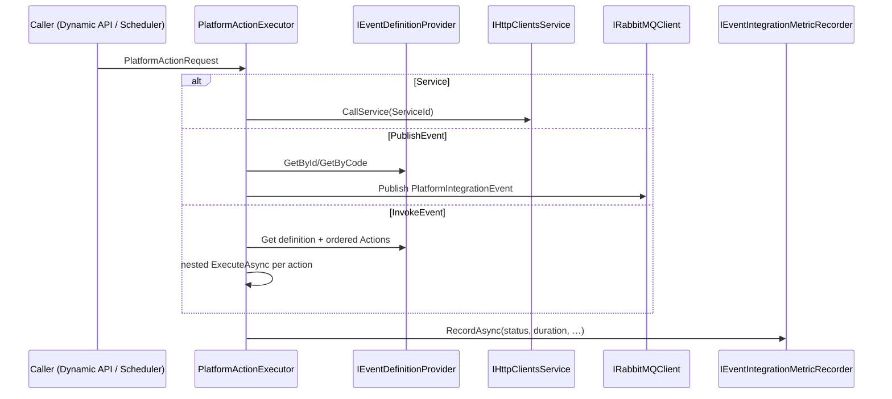

# Agents.PlatformIntegration.md — Event dispatch & platform actions (BiUM)

Platform integration contracts live in **`BiUM.Core.PlatformIntegration`**. Runtime orchestration is in **`BiUM.Specialized.Services.PlatformIntegration`**.

## 1. Components

| Type | Location | Role |
|------|----------|------|
| `EventDefinitionDto`, `PlatformActionRequest` | `BiUM.Core/PlatformIntegration/` | Shared DTOs |
| `IEventDefinitionProvider` | Core | Load event metadata (`GetByIdAsync`, `GetByCodeAsync`) |
| `IPlatformActionExecutor` | Core | Execute Service / PublishEvent / InvokeEvent |
| `IEventIntegrationMetricRecorder` | Core | Record integration attempt metrics |
| `PlatformActionExecutor` | Specialized | Default executor (HTTP service call, RMQ publish, nested invoke) |
| `HttpEventDefinitionProvider` | Infrastructure | Remote: `GET /api/configuration/Event/GetFwEventDefinition` |
| `HttpEventIntegrationMetricRecorder` | Infrastructure | Remote: `POST /api/observability/EventIntegrationMetric/RecordEventIntegrationMetric` |
| `NoOpEventIntegrationMetricRecorder` | Core | No-op when Observability is unavailable |
| `PlatformIntegrationEvent` | Core (`MessageBroker/Events`) | RMQ payload for outbound platform events |
| `DynamicApiEventPublisher` | Specialized | `ctx.Events.PublishAsync` → `IPlatformActionExecutor` |

## 2. Action types

Uses parameter GUIDs from `Ids.Parameter`:

- **`EventActionType`**: `Service`, `PublishEvent`, `InvokeEvent`
- **`SchedulerTriggerType`**: same three values for Hangfire jobs
- **`EventChannelType`**: `InternalRabbitMq`, `ExternalRabbitMq`, `ExternalHttpWebhook`, `Mqtt` (MQTT publish not implemented yet)

## 3. Execution flow



## 4. DI defaults (`ConfigureSpecializedServices`)

All of the following are **`AddScoped`** (they consume scoped `IHttpClientsService`; do not re-register as Singleton):

- `IEventDefinitionProvider` → `HttpEventDefinitionProvider`
- `IEventIntegrationMetricRecorder` → `HttpEventIntegrationMetricRecorder`
- `IPlatformActionExecutor` → `PlatformActionExecutor`
- `IDynamicApiEventPublisher` → `DynamicApiEventPublisher`

Microservices that **own** event metadata (Configuration) or need local overrides replace `IEventDefinitionProvider` / recorder in their `ConfigureServices` after `AddSpecializedServices`, keeping the same **Scoped** lifetime.

## 5. Dynamic API surface

Handler code:

```csharp
await ctx.Events.PublishAsync(eventId);
await ctx.Events.PublishAsync("my-event-code");
```

Parameters from the HTTP request are **not** automatically forwarded to platform events today; extend `DynamicApiEventPublisher` / executor call sites when product requires parameter mapping.

## 6. Related services

- [BiApp.Configuration — Agents.Events.md](../BiApp.Configuration/Agents.Events.md) — `EVENT*` metadata tables & admin API
- [BiApp.Scheduler — AGENTS.md](../BiApp.Scheduler/AGENTS.md) — `ScheduledTask.TriggerType` + modern triggers
- [BiApp.Observability — AGENTS.md](../BiApp.Observability/AGENTS.md) — `EVENT_INTEGRATION_METRIC`
- [Agents.DynamicApi.md](Agents.DynamicApi.md) — `ctx.*` runtime surface
- [Agents.MessageBroker.md](Agents.MessageBroker.md) — RabbitMQ client registration
