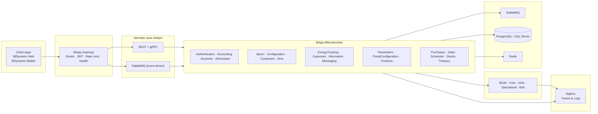
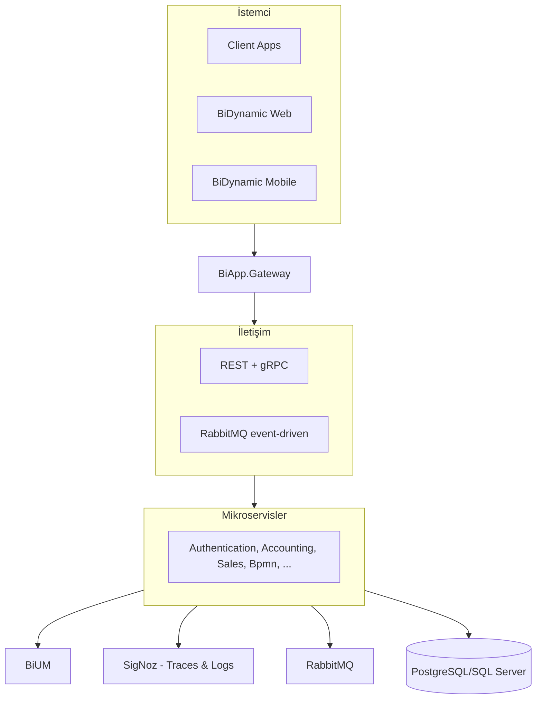

# BiDynamic Mimari Topoloji

## Topoloji görseli (PNG)

---

Aşağıdaki Mermaid diyagramı [mermaid.live](https://mermaid.live) veya VS Code Mermaid eklentisi ile PNG/SVG olarak dışa aktarılabilir.

## Güncellemeler
- **Client Apps** altında **BiDynamic Web** ve **BiDynamic Mobile** aynı font stiliyle gösterilir (parantez yok).
- Servisler arası iletişim: **REST + gRPC** ve **RabbitMQ (event-driven)** belirtilir.
- **SigNoz** (Traces & Logs) observability katmanı olarak eklenir.

## Basit kutu diyagramı (sunum için)

