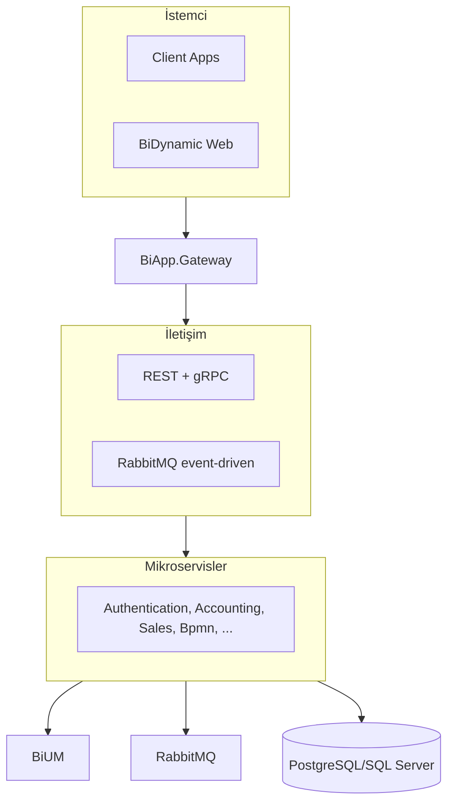

# BiDynamic Mimari Topoloji

## Topoloji görseli (PNG)


---

Aşağıdaki Mermaid diyagramı [mermaid.live](https://mermaid.live) veya VS Code Mermaid eklentisi ile PNG/SVG olarak dışa aktarılabilir.

## Güncellemeler
- **Client Apps** yanında **BiDynamic Web** (React SPA) gösterilir.
- Servisler arası iletişim: **REST + gRPC** ve **RabbitMQ (event-driven)** ayrıca belirtilir.

```mermaid
flowchart LR
    subgraph Clients[" "]
        CA[Client Apps (BiDynamic Web)]
    end

    subgraph Gateway[" "]
        GW[BiApp.Gateway<br/>Ocelot · JWT · Rate Limit · Health]
    end

    subgraph Comms["Servisler arası iletişim"]
        REST[REST + gRPC]
        MQ[RabbitMQ (event-driven)]
    end

    subgraph Services["BiApp Mikroservisler"]
        direction TB
        S1[Authentication · Accounting · Accounts · AiAssistant]
        S2[Bpmn · Configuration · Customers · Dms]
        S3[EnergyTracking · Expenses · Information · Messaging]
        S4[Parameters · PortalConfiguration · Products]
        S5[Purchases · Sales · Scheduler · Stocks · Treasury]
    end

    subgraph Platform[" "]
        BIUM[BiUM · Core · Infra · Specialized · Bolt]
    end

    subgraph Data[" "]
        Rabbit[RabbitMQ]
        DB[(PostgreSQL / SQL Server)]
        Redis[Redis]
    end

    CA --> GW
    GW --> REST
    GW --> MQ
    REST --> Services
    MQ --> Services
    Services --> BIUM
    Services --> Rabbit
    Services --> DB
    Services --> Redis
```

## Basit kutu diyagramı (sunum için)


